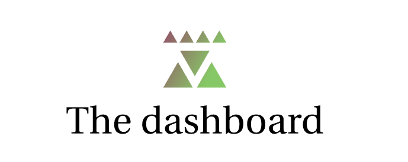

 

  

# The dashboard

This purpose of this dashboard is to provide a simple way to get and overview over your vehicles.

 # Tech Stack

**Client:** React, TypeScript and Material-ui

# Run the project locally

1. Clone this repo
2. Navigate to project directory
3. Run `npm install`
4. Run `npm start`

It runs the app in the development mode.\
Open [http://localhost:3000](http://localhost:3000) to view it in the browser.

The page will reload if you make edits.\
You will also see any lint errors in the console.